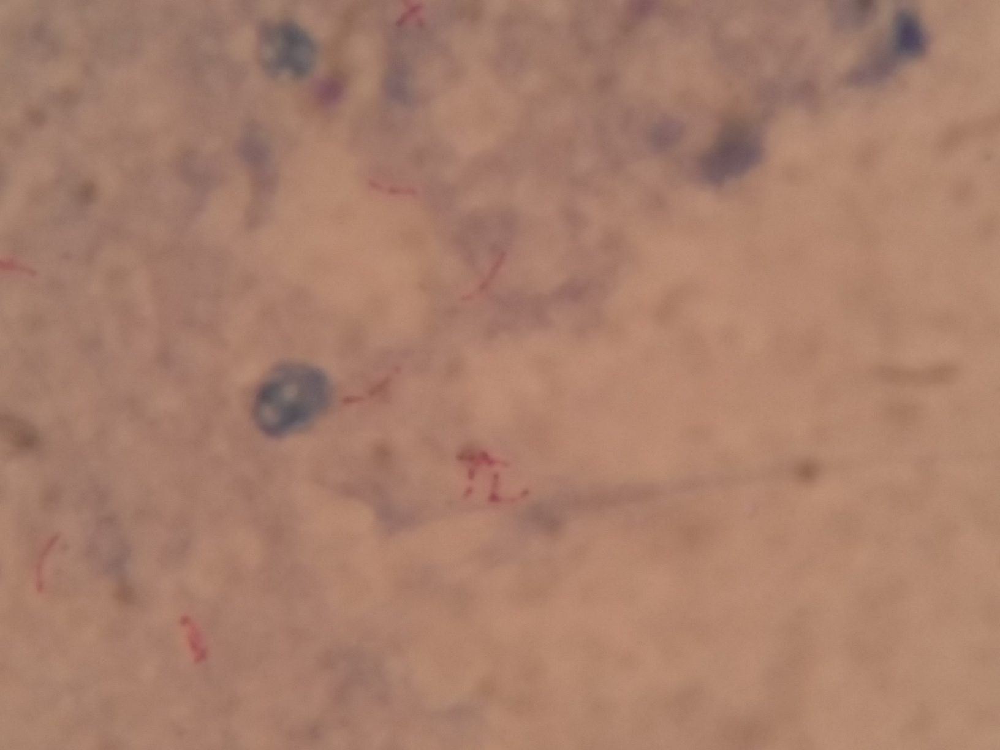
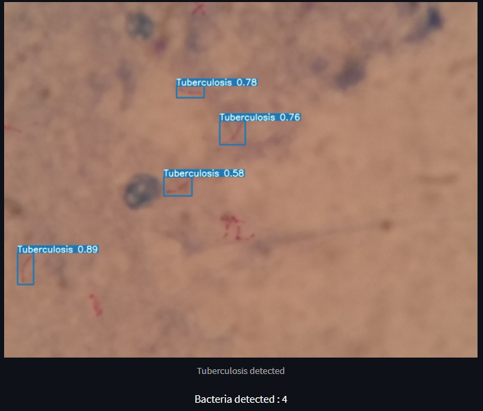

# Tuberculosis-Detector


This program receive an Suptum Sample image with 1632 x 1224 
Inference using torch hub and onnx
<p float="left"> 
  
   
</p>

# To load the weight use Gdown to download the .pth
```
pip3 install gdown
#onnx
RUN gdown --fuzzy https://drive.google.com/file/d/1--Nk3-4zXsPVsZoid162ozujyWXrdu9V/view?usp=sharing
#.pt
RUN gdown --fuzzy https://drive.google.com/file/d/10ByzNWVz-Vtg0qhIG4tO5ASfhmN0QhRu/view?usp=sharing

```
# Docker Pull
```
docker pull irfanheru66/tuberculosis-detector:1.0
```
# Docker Run
```
docker run -p 8501:8501 rfanheru66/tuberculosis-detector:1.0
```
- after that, on your local browser clik localhost:8501
